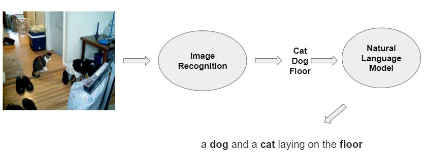

# Sheeko Project

Machine learning implementation package to generate descriptive metadata for digitized historical images. The project is funded through the LYRASIS Catalyst grant.

## Contents
* [Project Overview](#Project-OverView)
    * [Introduction](#introduction)
    * [Architecture](#architecture)
* [Getting Started](#getting-started)
    * [Prerequisites](#Prerequisites)
    * [Installation](#Installation)
    * [Test Installation](#Test-Installation)
* [Walkthrough](#Walkthrough)
* [Prepare you Data](#Data-Preparation)
    * [Clean your data](#Clean-Data)
    * [Build your data](#Build-Data)
    * [Build TF Records](#Build-TF-Records)
* [Training a Model](#training-a-model)
    * [Initial Training For Caption Model](#initial-training)
    * [Fine Tune Caption Model With Pretrained Model](#fine-tune-the-im2txt-model)
* [Evaluate your Caption Model](#Evaluation-Caption-Model)
* [Inference](#Inference)
    * [Image Caption](#Image-Caption)
    * [Image Classification](#Image-Classification)
    * [Object Detection](#Object-Detection)
* [Pretrained Models](#Sheeko-Pretrained-Models-Resource) 


## Project Overview

This project provides deployable machine learning environment including pre-trained models and code packages for training, inference and evaluation for generating caption metadata. Inference codes for label generating (classification, object detect) are also included in this project.

### Introduction

Inference Example for given image


Caption: 
  ```
  a bird sitting on top of a wooden bench . (p=0.001655)
  ```

Label: 
```
jay
indigo bunting, indigo finch, indigo bird, Passerina cyanea
magpie
pill bottle
water ouzel, dipper
Bird
```
### Architecture

This code package is the customization of Im2txt. Please see https://github.com/tensorflow/models/tree/master/research/im2txt for more details about im2txt


Architecture of Caption generating model in this project is ["Show and Tell model"](http://arxiv.org/abs/1609.06647) which is an encoder-decoder neural network.


<p align="center"> </p>


## Getting Started

These instructions will get you a copy of the project up and running on your local machine for development and testing purposes. See deployment for notes on how to deploy the project on a live system.

### Prerequisites
<p><b>For GPU acceleration, script has to run locally, please install required packages</b></p>
<ul>
<li><p>Ubuntu 16.04.6 LTS OS environment or Windows OS</p></li>
<li><p>NVIDIA GPU and NVIDIA Driver installed</p></li>
<li><p>Python 2.7 or Python 3</p></li>
<li><p>Tensorflow (For GPU version, please see https://www.tensorflow.org/install/gpu to install cuda related packages)</p></li>
<li><p><a href="https://www.nltk.org/">Natural Language Toolkit (NLTK)</a></p></li>
<li><p>Natural Language Toolkit (NLTK) punkt package</p></li>   
<li><p><a href="https://spacy.io/">spaCy</a></p></li>
<li><p><a href="https://pypi.org/project/python-resize-image/">python-resize-image</a></p></li>
<li><p>Pre-trained statistical NLP model: <a href="https://spacy.io/models/en">en_core_web_sm</a></p></li>
<li><p><a href="https://pypi.org/project/singledispatch/">singledispatch</a></p></li>   
<li><p><a href="https://pypi.org/project/contextlib2/">contextlib2</a></p></li>
<li><p><a href="https://pypi.org/project/Cython/">Cython</a></p></li>
</ul>

<p><b>For VirtualBox Environment</b></p>
<ul>
   <li><p>Virtualbox Installed</p></li>
   <li><p>vt-x enabled</p></li>
</ul>

### Installation

<b>To Install Locally</b>

To enable GPU accleration for training and evaluation, it's recommened to run the code in Ubuntu 16.04.6 LTS OS or Windows OS environment 

Run the script to see python version. Make sure python is installed properly.

```
python -V
```

<ul>
   <li><p>For Windows OS</p>
   Install the required packages listed above.
   To install punkt, run python script: 
   import nltk
   nltk.download("punkt")
   </li>   
   <li><p>For Linux OS</p>
Run script under project root directory
      
```
bash installation.sh
```
      
</li>
</ul>
     
<b>Use VirtualBox</b>

This code package is supported using vagrant with virtualbox installed and vt-x option enabled in BIOS mode. Please be aware that there is limitation for GPU allocation in VirtualBox environment. So It's not recommended to run either training or evaluation script in VirtualBox. 

Alternatively, please migrate the installation.sh, train, evaluation and library directories to local machine for the purpose. 
For linux OS, run "bash installation.sh" under project root directory to install prerequisites packages before running training or evaluation scripts. For windows OS, install the required packages in [Prerequisites](#Prerequisites).

Run the script under project root directory through command line
```
vagrant up
```

### Test Installation
Login into vagrant box first
```
vagrant ssh
```

Run following scripts to test packages installation
```
python -c 'import tensorflow as tf; print(tf.__version__)'
```
Version of the tensorflow will be printed as result if successfully installed
```
python -c 'import nltk; print(nltk.__version__)'
```
Version of the nltk will be printed as result if successfully installed


## Walkthrough

<h3>What's included in the package</h3>
<ul>
   <li>Data Preparation</li>
   <li>Training</li>
   <li>Evaluation</li>
   <li>Inference</li>
</ul>

In this section we're going to demo <i>how to perform the inference</i> and <i>how to get your own model</i>

Inference

To get pretrained model caption, classification, object detect model

Get test images

Configure code

Test

To perform multi-image 


Training

To get data

Clean data
Configure code

Build Data
Configure code

Build TF Record
Configure code

Run training 
Configure code

Get test images

Run Inference
Configure code

Run Evaluation
Configure code


To demo the Inference for pretrained models, Please go to [Inference](#Inference)

To train your own model for generating caption, Please start with [Data Preparation](#Data-Preparation) 

#### Get Started
If you installed the packaged locally,
* Skip the first step and following the rest of steps
If you installed the packaged using vagrant box,
* 1. login into vagrant box
```
vagrant ssh
```
* 2. migrate annotation files that need to clean into project directory.

e.g. data_preparation\data contains demo data to perform NLP cleaning

* 3. navigate to data_preparation directory and open clean_data_run.py file and configure the following setting
```
# Field name in annotation file containing metadata
FIELD_NM = "description_t" 
e.g. "{
    "date_t": 1943,
    "description_t": "Brooch made by internees at the Topaz Internment Camp in Delta, Utah. Residents would gather sea shells found at the camp, bleach them, and then paint and arrange them into brooches and other designs.",
    ...
    "

# List of paths (relative or absolute)of directories containing the meta data that needs cleaning
# This will perform NLP cleaning and remove proper-nouns
DATA_DIR_LIST = ['data/demo_1']

# or using Loop function to perform NLP on all sub directories under the given directory
DATA_DIR = 'data'


# Path to output directory
OUTPUT_PATH = "clean"
```

## Data Preparation
Data from any source for caption generating model need following the required pattern.

Both images files in JPEG format and descriptive annotation files in json format are required.
* JPEG image
* JSON annotation file containing metadata of caption associated with JPEG image

#### JSON Annotation File Example
```

[
images:[{
"file_name": "/vagrant/data/dc_bpc/125853.jpg", "id": 57870
}, ...
]
annotations:[{  id: 1,  image_id: 57870,  file_name: "COCO_train2014_000000000009.jpg"  caption: "a cat and dog on wooden floor next to a stairwell."}, ...
]

```
[The sheeko pretrained models](#Sheeko-Pretrained-Models-Resource) are trained using the data source below:

* 120 K images with metadata in MSCOCO dataset (http://cocodataset.org)
* 470 K images with metadata in J. Willard Marriott Digital Library Collections ( https://collections.lib.utah.edu/)

### Clean Data
This step is not required if your data set is clean and doesn't contain any noise (e.g. proper-noun). In this section we're removing proper-noun type noises using spaCy based NLP process in data set.

#### Toolkit

API: spaCy

Model: [en_core_web_sm](https://spacy.io/models/en)

#### What does it do?

* Remove proper-noun noise

* Simplify annotation file by leaving image_id and metadata field only

* Save cleaned annotation file in the destination directory following the same directory structure

* Create data report in JSON format under destination directory

    * **valid metadata**: total number of captions that have valid JPEG images found and got non empty result after NLP process
    * **dir name**: /path/to/data/dir, 
    * **none pronoun**: total number of captions that have valid JPEG images found and are proper-noun noise free 
    * **pronoun**: total number of captions that have valid JPEG images found and have proper-noun noise
    * **data count**: total number of captions that have valid JPEG images found

#### Neuro-linguistic programming (NLP) Steps
##### step 1: PRONOUN cleaning
* 1.1 replace named person with "person"

example: Mary Jane with daughters --> a person with daughters
* 1.2 remove DATE, TIME, ORG, GPE, LOC, PRODUCT, EVENT, WORK ART, LAW, LANGUAGE, FAC, NORP, PERCENT, MONEY, QUANTITY, ORIGINAL     
and get their parent node, if there's no parent node, then abort this sentence)

example: A women group is photographed at the Ashley Power Plant up Taylor Mountain road --> A women group is photographed
##### step 2: Parent nodes cleaning 
* 2.1 if the parent node is 'DET', 'NOUN', 'NUM', 'PUNCT', 'CCONJ', 'VERB', remove the subtrees nodes of the lefts if it's not in the list 
* 2.2 if the parent node is PREP or other types, remove the nodes and their children nodes

example: A woman tends to a fire at a Ute Indian camp near Brush Creek. --> A woman tends to a fire at a camp .

##### step 3: NOUN entities cleaning
* 3.1 replace the chunk of non-named enties chunk with simple entity along with CC, CD, DT and IN
* 3.2 replace CD type number with string value, e.g. 3, three

example: Ute couple with child stand in front of old cars --> couple with child stand in front of cars

##### step 4: Reform
* 4.1 put person entity and chunk replacement in position
* 4.2 replace person entities with understandable words, e.g. ,if multiple people then use num people instead, e.g. "a person" "two people", else say "a group of people"
* 4.3 replace nums of person entities (>=3) replace with "a group of " + noun
* 4.4 remove the tokens with index in indexes list of the sentence and convert the array to sentence 


### Build Data

#### Description
Formatted data in structure is required for the package. To create format data we need to go through build data section.

#### What does it do?
* Filter data set by getting data that have both images and associating annotation only
* Segment images and annotation files into training and testing data sets
* Resize image to trainable format into training and testing data set
* Build annotation file for training and testing data set

##### Segment Mode
We provide two segment methods:

1. segment all data through out all directories as one into training and testing data set.

2. segment the list of directories into training and testing sets.

* seg_by_image
segment data set in each directory with given percentage of data into training set, the rest into test


* seg_by_dir
segment directories with given percentage into training set, the rest of directories into test

#### Steps
* Make clear the purpose: Training, Inference or Evaluation
* Prepare your data according to the purpose
* Make sure you have enough space in the output directory to store the output result ( 6 X of original data set in file size)

#### For particular purpose
##### Training
* Prepare images file in JPG format (single file size no more than 15 mb) and associating annotation files in JSON format. 
Structure your data: image file name has to be unique id and annotation file has to has the same image_id of image file name (e.g. 15376.jpg,  annotation: "image_id": 15376 )
* Structure your data: annotation files have to use the consistent field for getting metadata (e.g. "description_t")

##### Optional: clean up proper-noun and data noise in your annotation file by using clean_data_run.py and configure field name of metadata field, list of paths to annotation files and output directory, for more details, please see Data Cleaning page.
* Configure arguments in build_data_run.py (field names in annotation file, list of paths to annotation files and image files, output directory and data segmentation args, e.g. method and training set percentage )
Run build_data_run.py
* Formatted data will be available in the directory you specified as OUTPUT_PATH in build_data_run.py
* For im2txt captioning model training. Run build_TF_run.py to generating TF Records. Each image object contains "file_name" and "id". Each annotation object contains "id", "image_id" and "caption". Each image object may refers to multiple caption objects
* TF Records will be located under OUTPUT_PATH which is runnable data for the training

##### Inference
* Prepare images file for inference in JPG format
* Prepare checkpoint file of model and corresponding vocabulary file 
* Configure arguments in build_data_run.py (field names in annotation file, list of paths to annotation files and image files and output directory)
* Run build_data_run.py
* Inference results will be stored in OUTPUT_PATH in caption_infer.py 


### Build TF Records    
   
## Training a Model

### Initial Training
    
### Fine Tune the im2txt Model 
## Evaluation Caption Model

### Evaluation Caption Model
##### Metric
Caption: perplexity per word

## Inference

### Image Caption
 
### Image Classification
 
### Object Detection
 
## Sheeko Pretrained Models Resource
This project provides [Sheeko Pretrained Models Resource](https://sheeko.org/pre-trained-models/) for generating captions.
Models with description are available for downloading. It's highly recommended to try the downloaded model in [Inference](#Inference) to test the performance.

## Windows and Linux switch (path / for linux or \\ for windows)
## Data built in linux environment could not be used in Windows, you have to run data build in windows environment to build the format for windows
## Installation script implementation for windows and linux (linux run installation.sh, windows run installaation_win.sh)
## GPU Use (run locally, specify which gpu)
## Metadata field (example of specifing metadata field and image id for cleaning, data build)
## Model Migration (clear absolute path to make relative)
## Provide resources downloading inception v3 model, classified label model and object detect model

## Built With

* [Dropwizard](http://www.dropwizard.io/1.0.2/docs/) - The web framework used
* [Maven](https://maven.apache.org/) - Dependency Management
* [ROME](https://rometools.github.io/rome/) - Used to generate RSS Feeds

## Contributing

Please read [CONTRIBUTING.md](https://gist.github.com/PurpleBooth/b24679402957c63ec426) for details on our code of conduct, and the process for submitting pull requests to us.

## Versioning

We use [SemVer](http://semver.org/) for versioning. For the versions available, see the [tags on this repository](https://github.com/your/project/tags). 

## Authors

* **Billie Thompson** - *Initial work* - [PurpleBooth](https://github.com/PurpleBooth)

See also the list of [contributors](https://github.com/your/project/contributors) who participated in this project.

## License

This project is licensed under the MIT License - see the [LICENSE.md](LICENSE.md) file for details

## Acknowledgments

* Hat tip to anyone whose code was used
* Inspiration
* etc
